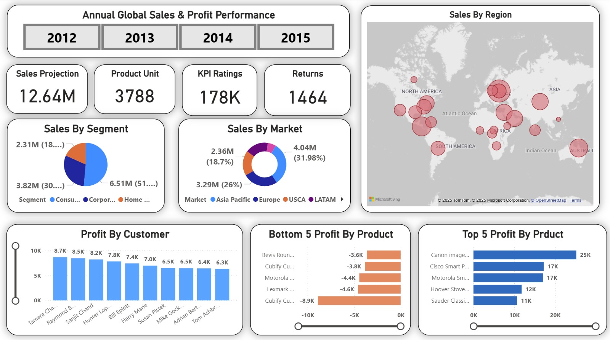

## Annual Global Sales & Profit Perfomance

**Sales and Profit Report**
1. Slicers, Cards & Insert Formatting 
2. Pie | Donut Chart 
3. Stacked Column Charts | Clustered Bar Chart
4. Map

---

### **Slicers, Cards & Insert Formatting  -1**

#### **Slicer**
- **Field:** Order Year
- **Format** → *Title* 
- **Format** → *Slicer header*  turn off

**Card 1: Sale Projection**
- **Card (Build)** → **Field** : Sales
- **Format** → *Title* On
	- Title —> Text : Sales Projection
	- Font —> 15
- **Format** → *Callout Value* 
	- Font : 35

**Card 2: Product Unit**
- **Card (Build)** → **Field** : Product Name
- **Card (Build)** → **Field** : right click and select count (distinct)
- **Format** → *Title* On
	- Title —> Text : Product Unit
	- Font —> 15
- **Format** → *Callout Value* 
	- Font : 35

**Card 3: KPI Ratings**
- **Card (Build)** → **Field** : Quantity
- **Format** → *Title* On
	- Title —> Text : KPI Ratings
	- Font —> 15
- **Format** → *Callout Value* 
	- Font : 35

**Card 4: Return Rates**
- **Card (Build)** → **Field** : Sip Date
- **Card (Build)** → **Field** : right click and select count (distinct)
- **Format** → *Title* On
	- Title —> Text : Return Date
	- Font —> 15
- **Format** → *Callout Value* 
	- Font : 35
---

### **Pie | Donut Chart | Stacked Column Charts - 2**

#### **Pie Chart**
- **Legend:**  Segment
- **Values:** Sales

- **Format** → *Title* OnOn
	- Title —> Text : Sale By Segment
	- Font —> 24
- **Format** → *Detal labels*  Off
- **Format** → *Value* 
    - Font : 10
- **Format** → *Legend* 
    - Option —> Position : bottom center
    - Text —> Font : 10 bold

#### **Donut Chart**
- **Legend:**   Market
- **Values:** Sales

---

### **Stacked Column Charts | Clustered Bar Chart - 3**

#### **Stacked Column Chart - Profit by Customer**
- **X-Axis:** customer name
- **Y-Axis:** profit

**Apply Filter : Profit by Customer**
- **Filter** 
  - Customer Name
    - Filter type → Top N
    - Show items →  10
    - By value  → Profit
    - Click **Apply Filter**

#### **Cluster Bar Chart - Bottom 5 Profit By Product**
- **X-Axis:** product name
- **Y-Axis:** profit

**Apply Filter : Bottom 5 Profit By Product***
- **Filter** 
  - Product Name
    - Filter type → Top N —> Bottom
    - Show items →  5
    - By value  → Profit
    - Click **Apply Filter**

#### **Cluster Bar Chart - Top 5 Profit By Product**
- **X-Axis:** product name
- **Y-Axis:** profit

**Apply Filter : Top 5 Profit By Product**
- **Filter** 
  - Product Name
    - Filter type → Top N
    - Show items →  5
    - By value  → Profit
    - Click **Apply Filter**
---
### **Map - 4**

#### **Map - Sales By Region**
- **Location:** region
- **Sales:** profit

---

### **Annual Global Sales & Profit Perfomance**

    </img>

